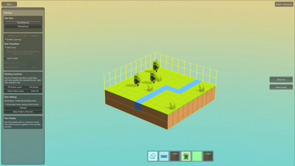
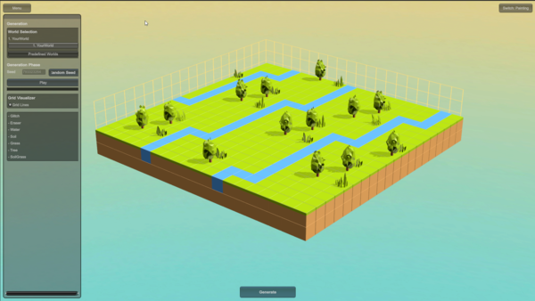

# 🌍 WorldLattice Devlog #2 — **When a Tool Decides It Wants to Be a Game**

## **When You Stop Forcing Shape, Things Start Living**
Most people force their projects into a shape they decided long before the project had a chance to breathe.  
I used to do that too — not out of love for control, but because it was the only “right way” I was taught.

But deep down, I’ve always wanted things to grow on their own.  
Maybe because I never really got that chance myself — every part of who I was had to be justified, defended and trimmed to fit someone else’s plan.

At some point, I stopped suffocating ideas.  
I gave them space.  
I let them become what they wanted instead of what I expected.

### **The Identity Shift: From Developer Tool → Something Else**
WorldLattice was meant to be a clean, modular **developer tool**.  
That was the identity I built for it.

Then it started drifting — refusing the shape I tried to give it.  
And instead of forcing it back, I let it wander.

That’s when it stopped being a tool.  
**It became a game.**

Not a big game — more like a strange little creature made of rules and possibility.

### **The Core Loop: You Paint the Seed, The World Grows**  

  

You paint a tiny sample world.

  

WorldLattice grows it into a full landscape.

**This is the entire core loop of WorldLattice.**

You pick up a brush.  
You paint a small “sample world” using the built-in tiles.  
Then you press generate.

Under the hood, WorldLattice uses a custom implementation inspired by the **Overlapping Wave Function Collapse algorithm** by Maxim Gumin — but heavily mutated through my own insanity.  
It interprets your sample.  
It extracts patterns.  
Then it grows a world that feels like your art but not controlled by your hand.

### **Try Seeds. Let Go. Watch It Evolve.**

You can spin different seeds.  
Each one grows a different version of the world — a variation of your tiny painted origin.  
Some seeds are chaos.  
Some are beautiful accidents.  
Some feel more “you” than what you originally painted.

When you find one you actually love, you hit screenshot.  
Save it. Share it. Show off your world grown out of your tiny sample.

### **Is it still a tool?**

Maybe.  
WorldLattice is just trying to figure its own life out the same way its creator is.

And that’s okay.

Right now it’s a **toy-game-generator-creature**, and honestly?  
It’s more alive than it has ever been

**— Hani Jahan**  
_WorldLattice Project_

**References:**  
WFC by Maxim Gumin  
[https://github.com/mxgmn/WaveFunctionCollapse](https://github.com/mxgmn/WaveFunctionCollapse)